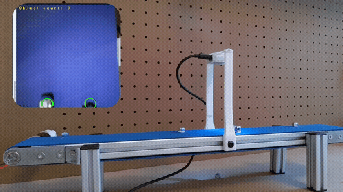

# Training Models with Synthetic Data: End to End Conveyor Belt Counting Walkthrough with Edge Impulse 
)

This repository contains the openmv files, dataset generation notebook, 3d printer files and source files related to this walkthrough:
https://www.youtube.com/watch?v=5IdWzaJNkk0

Public project: https://studio.edgeimpulse.com/public/187740/latest

|                          | Bill Of Materials                                                      |
|--------------------------|------------------------------------------------------------------------|
| 60mmx500mm Conveyor Belt | https://asconveyorsystems.co.uk/type20-miniature-conveyor-belt-system/ |
| Arduino Nicla Vision     | https://store.arduino.cc/products/nicla-vision                         |
| M5 Nyloc Nuts            | https://uk.rs-online.com/web/p/hex-nuts/0524310                        |
| Upright Mount x2         | conveyor belt upright.stl                                              |
| Bottom Case              | bottom case nicla vision.stl                                           |
| Top Case                 | top case nicla vision.stl                                              |
